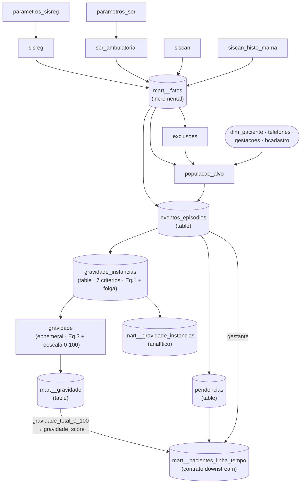

# monitora_cancer

Monitoramento da linha de cuidado de **câncer de mama** na rede municipal
do Rio de Janeiro. Integra três sistemas de origem (SISCAN, SISREG, SER),
reconstrói a jornada de cada paciente e produz **uma fila de urgência de
contato** (score de gravidade) e uma **linha do tempo por paciente**.

- **Frequência de atualização**: diária (tag `daily`).
- **Proprietário**: `SMS/SUBGERAL/CR/NTI`.
- **Schema BigQuery**: `projeto_monitora_cancer`.
- **Domínio (label)**: `subgeral`. Dados pessoais e sensíveis.

> Este README cobre o **projeto inteiro**. O **score de gravidade** tem
> documentação dedicada (fórmula, pseudocódigo e exemplo numérico) em
> [`gravidade_indicador/README.md`](gravidade_indicador/README.md).

## Quem consome o quê

| Mart | Granularidade | Para que serve |
|---|---|---|
| `mart_monitora_cancer__pacientes_linha_tempo` | 1 linha por paciente | **Contrato externo** (aplicação / ferramentas analíticas). Linha do tempo + status + `gravidade_score`. |
| `mart_monitora_cancer__gravidade` | 1 linha por paciente | Fila de urgência de contato — ordenar por `gravidade_total DESC, gestante DESC`. |
| `mart_monitora_cancer__gravidade_instancias` | 1 linha por critério ativo | Análises de calibração de pesos e de sensibilidade (Python). |
| `mart_monitora_cancer__fatos` | 1 linha por evento | Base factual de eventos (SISCAN / SISREG / SER). Incremental. |

## DAG conceitual

Grupos funcionais dos modelos intermediários:

- **fontes** — `sisreg`, `ser_ambulatorial`, `siscan`, `siscan_histo_mama`
  (1 modelo por sistema) + `parametros_sisreg`, `parametros_ser`. Apenas
  renomeação, tipagem e filtro de interesse — sem business logic complexa.
- **população** — `populacao_alvo` (universo inicial) e `exclusoes`
  (filtra quem deve sair).
- **eventos** — `eventos_episodios` (compute compartilhado por paciente,
  com `run_id`) e `pendencias`.
- **gravidade** (`gravidade_indicador/`) — `eventos_run_atual` (fonte
  ephemeral compartilhada da jornada atual), 7 modelos de critério em
  `criterios/`, `gravidade_instancias` (agregador) e `gravidade`
  (orquestrador do score). README dedicado em
  [`gravidade_indicador/README.md`](gravidade_indicador/README.md).

## Domínio em uma página

- **Evento** — uma linha em `mart__fatos`. Granularidade
  `(sistema_origem, id_sistema_origem)`. Vem de SISREG, SER ou SISCAN.
- **Jornada / episódio (run)** — sequência consecutiva de eventos da mesma
  paciente cujos gaps de `data_referencia_evento` são **≤ 180 dias**
  (`episodio_gap_dias`). O `run_id` incrementa a cada gap maior que isso.
  O score e a linha do tempo consideram **apenas a jornada atual** (a
  sequência de eventos mais recente).
- **Status da paciente** — calculado **apenas sobre os eventos da jornada
  atual** (eventos de jornadas antigas não contam), em
  `int_monitora_cancer__eventos_episodios`: `UNACON` quando há ≥1 evento SER
  na jornada atual (entrada na regulação para oncologia); `DIAGNOSTICO`
  quando há evento com critério de diagnóstico confirmado na jornada atual;
  `SUSPEITA` nos demais casos da população-alvo.
- **Score de gravidade** — número que ordena as pacientes da jornada atual por
  **urgência de contato**: combina, por critério ativo, atraso × risco ×
  peso clínico, agrega por paciente (maior contribuição + soma das
  contribuições) e aplica multiplicador de gestante. A fila ordena por
  `gravidade_total` (bruto); `gravidade_total_0_100` é só apresentação.
  **Fórmula, pseudocódigo e exemplo numérico em
  [`gravidade_indicador/README.md`](gravidade_indicador/README.md).**

## Decisões arquiteturais

- **`eventos_episodios` é `table` (não `ephemeral`)** — é compartilhado
  pela cadeia de gravidade e por `mart__pacientes_linha_tempo`;
  materializar evita recomputar o cálculo de `run_id` duas vezes.
- **`gravidade_instancias` é `table`** — compartilhado por `int__gravidade`
  (score final) e por `mart__gravidade_instancias` (consumo analítico);
  clusterizado por `criterio` para acelerar filtros das análises.
- **`gravidade` (orquestrador) é `ephemeral`** — é só agregação consumida
  por um único modelo (`mart__gravidade`); não há ganho em materializar.
- **`mart__gravidade` é um passthrough do intermediário** — existe para dar
  um **contrato downstream estável** (nome/alias/schema), isolando o mart
  da reorganização interna da camada intermediária.
- **`episodio_gap_dias = 180`** — eventos separados por mais de ~6 meses
  são tratados como jornadas de cuidado distintas.

## Como adicionar uma nova fonte de dados

1. Criar `int_monitora_cancer__<nome>` (modelo staging-like do grupo
   **fontes**): renomear/tipar/filtrar a fonte para o formato de evento.
2. Adicioná-lo ao `UNION` em `mart_monitora_cancer__fatos`.
3. Atualizar o `accepted_values` de `sistema_origem` em
   `_mart_monitora_cancer__schema.yml`.
4. Conferir downstream: se a nova fonte deve disparar/desativar algum
   critério de gravidade, ajustar `gravidade_indicador/`.

## Como adicionar um novo critério de gravidade

Cada critério é **1 arquivo ephemeral** em
[`gravidade_indicador/criterios/`](gravidade_indicador/criterios/) que emite
a relação canônica bruta; o agregador
[`gravidade_indicador/int_monitora_cancer__gravidade_instancias.sql`](gravidade_indicador/int_monitora_cancer__gravidade_instancias.sql)
faz o `UNION ALL` e aplica a fórmula. Passo a passo completo em
[`gravidade_indicador/criterios/README.md`](gravidade_indicador/criterios/README.md).

Resumo: (1) copiar um arquivo da mesma família (cross/intra-evento);
(2) ajustar gatilho/desfecho, intervalo (``) e
peso (macro `monitora_cancer_pesos_clinicos`); (3) adicionar o `ref()` no
`UNION ALL` do agregador; (4) atualizar o `accepted_values` do teste
`criterio` no `_gravidade_indicador__schema.yml` (mart).

## Glossário de projeto

Termos de domínio do projeto. Os termos **específicos do score**
(trigger, `dias_atraso`, `fator_tempo`, `fator_risco`,
`gravidade_criterio`, `gravidade_termo_max`, `gravidade_termo_soma`,
`peso_carga_total`, `multiplicador_gestante`) estão definidos em
[`gravidade_indicador/README.md`](gravidade_indicador/README.md).

| Termo | Definição |
|---|---|
| **evento** | Linha em `mart__fatos`. Granularidade `(sistema_origem, id_sistema_origem)`. SISREG, SER ou SISCAN. |
| **população-alvo** | Universo inicial de pacientes do monitoramento (`int_monitora_cancer__populacao_alvo`). |
| **exclusões** | Regras que removem pacientes da população-alvo (`int_monitora_cancer__exclusoes`). |
| **jornada / episódio (run)** | Sequência consecutiva de eventos da paciente com gaps de `data_referencia_evento` ≤ 180 dias. A mais recente é a **jornada atual**. |
| **run_id / jornada_id** | Identificador da jornada; incrementa a cada gap > `episodio_gap_dias` (180) dentro do mesmo paciente. |
| **data_referencia_evento** | `MAX` das datas conhecidas do evento (solicitação, autorização, execução, resultado). |
| **critério** | Motivo registrado para a paciente precisar de atenção (par gatilho/desfecho-esperado). Uma paciente pode ter vários ativos. |
| **pendência** | Tarefa clínica esperando ser feita (ex.: biópsia pedida mas não realizada). Materializada em `int_monitora_cancer__pendencias`. |
| **UNACON** | Unidade de Alta Complexidade em Oncologia. Status atribuído quando há ≥1 evento SER na jornada atual. |
| **DIAGNOSTICO** | Status quando há evento com `criterio_diagnostico = TRUE` na jornada atual. |
| **SUSPEITA** | Status default da população-alvo (sem UNACON nem DIAGNOSTICO). |
| **BI-RADS** | Classificação radiológica de mamografia (Categoria 0..6). Mapeada para `risco` na fonte SISCAN. |
| **criterio_suspeita / criterio_diagnostico** | Flags que classificam o evento como suspeita ou diagnóstico (de `parametros_*` para SISREG/SER; de regras de laudo para SISCAN). |
| **gravidade_score** | Apresentação 0-100 do score exposta em `mart__pacientes_linha_tempo` (= `gravidade_total_0_100`). |

## Onde encontrar mais

- **Score de gravidade** (fórmula, pseudocódigo, exemplo numérico,
  parâmetros): [`gravidade_indicador/README.md`](gravidade_indicador/README.md).
- **Blocos de documentação (`docs` blocks)** reaproveitados na
  documentação do dbt:
  [`_monitora_cancer__overview.md`](_monitora_cancer__overview.md).
