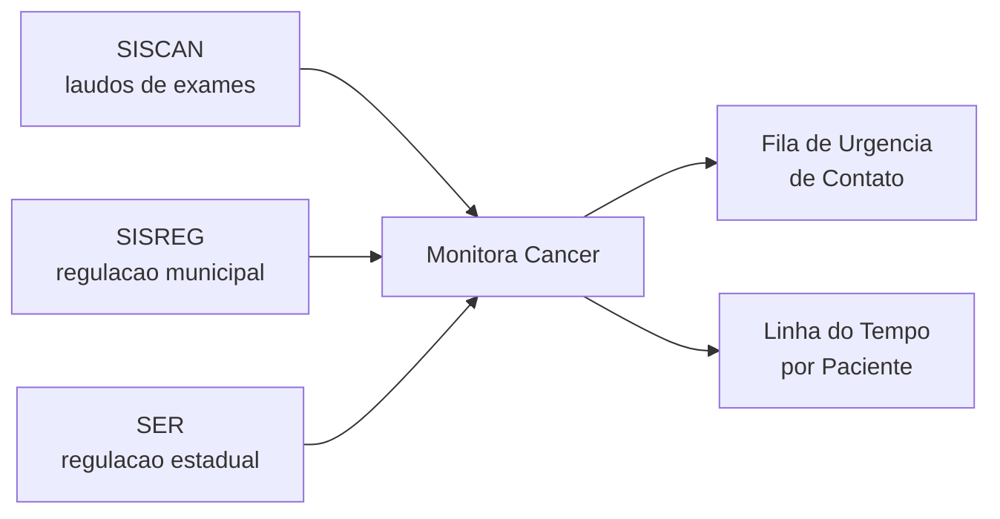
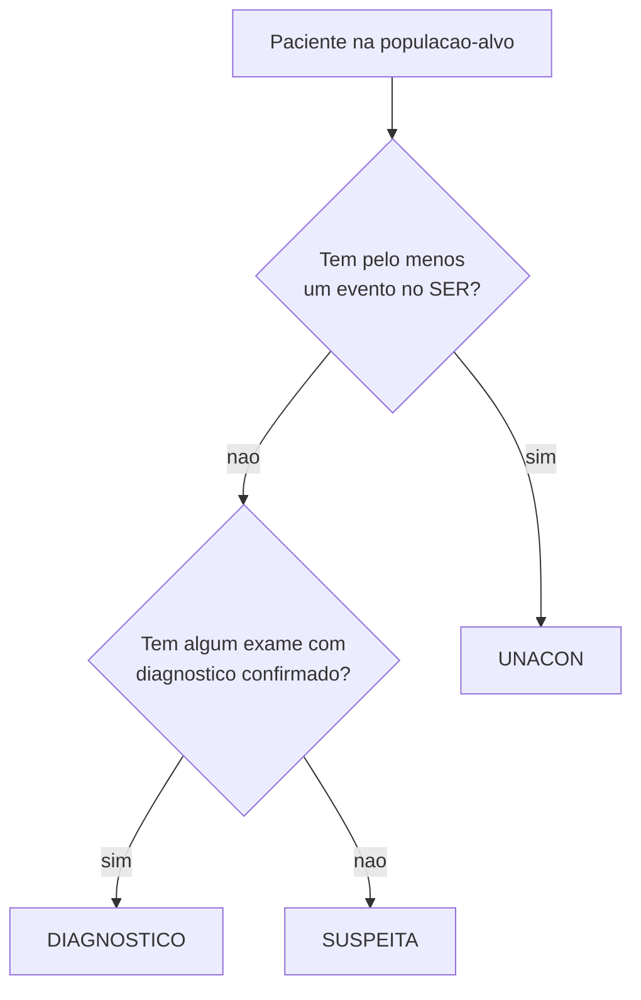
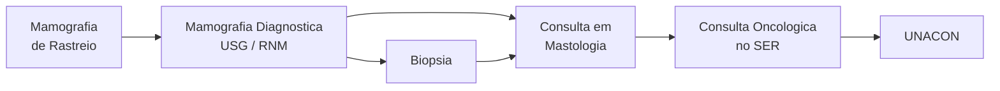

# Sobre o Monitora Câncer

## 1. Introdução

O Monitora Câncer é um sistema de acompanhamento da linha de cuidado do câncer de mama na rede municipal de saúde do Rio de Janeiro. Ele cruza informações de três sistemas oficiais para reconstruir a jornada de cada paciente em investigação ou tratamento e ajuda a equipe a priorizar os contatos do dia.

Este é um produto do **Núcleo de Tecnologia da Informação (NTI)**, vinculado à **Central de Regulação** da **Subsecretaria Geral (SUBGERAL)** da Secretaria Municipal de Saúde do Rio de Janeiro (SMS Rio).

O sistema entrega duas coisas principais:

- uma **fila de urgência de contato**, ordenada por um número (chamado *score de gravidade*) que indica quão urgente é ligar para cada paciente;
- uma **linha do tempo por paciente**, com todos os eventos registrados e as pendências em aberto.

## 2. Objetivo

A equipe da Central de Regulação não consegue ligar para todas as pacientes em monitoramento no mesmo dia. Precisa de uma forma justa de decidir por quem começar.

O objetivo do Monitora Câncer é responder, todos os dias, a duas perguntas:

1. **Quais pacientes estão em monitoramento agora?**
2. **Em qual ordem a equipe deve contatá-las?**

A resposta da primeira pergunta sai como uma lista de pacientes com seus dados de contato. A resposta da segunda pergunta sai como um número de 0 a 100 para cada paciente: quanto maior, mais urgente.

## 3. Fontes de Dados

O sistema cruza três fontes oficiais:

- **SISCAN** (Sistema de Informação do Câncer): registra os laudos de exames de mama, como mamografias e biópsias. Traz o resultado clínico, incluindo a categoria BI-RADS - uma classificação padronizada que vai de 0 a 6 e indica o grau de suspeita do exame.
- **SISREG** (Sistema de Regulação Municipal): registra os pedidos de exames e consultas na rede municipal do Rio. Traz as datas de solicitação, autorização e execução de cada procedimento.
- **SER** (Sistema Estadual de Regulação): registra os encaminhamentos para a alta complexidade oncológica, ou seja, para as **UNACON** (Unidades de Alta Complexidade em Oncologia). É a porta de entrada para o tratamento de câncer.

Cada exame, consulta ou encaminhamento vira uma linha no sistema (um evento). As três fontes alimentam a mesma base de eventos, e o restante da lógica trabalha em cima dela.

## 4. Lógica de Seleção de Pacientes e de Classificação

### Como uma paciente entra no monitoramento

Uma paciente entra na lista quando atende, ao mesmo tempo, a todos os critérios abaixo:

- é do sexo feminino (registro cadastral);
- está viva (sem registro de óbito);
- tem pelo menos um evento registrado a partir de **01/01/2025**;
- esse evento é considerado de **suspeita** ou de **diagnóstico** de câncer de mama (veja a Seção 5).

### Status da paciente

Quando uma paciente entra, ela também recebe um **status**. O status diz em que ponto da linha de cuidado ela está:

- **SUSPEITA**: há indícios em exames ou pedidos de exames, mas o câncer ainda não foi confirmado.
- **DIAGNÓSTICO**: o câncer foi confirmado por exame (por exemplo, mamografia BI-RADS categoria 6 ou biópsia com lesão neoplásica).
- **UNACON**: a paciente já foi encaminhada para uma unidade de alta complexidade oncológica - ou seja, tem pelo menos um evento registrado no SER.

A regra de decisão é a seguinte:

**Exemplo concreto.** Uma paciente faz mamografia e o laudo sai como BI-RADS 4. Ela entra com status SUSPEITA. Em seguida, faz uma biópsia que confirma lesão neoplásica: passa para DIAGNÓSTICO. Quando o pedido de consulta com mastologista oncológico aparece no SER, passa para UNACON.

## 5. Tabela de Procedimentos Monitorados

Cada procedimento abaixo é considerado de interesse para o monitoramento. As duas últimas colunas indicam se a presença daquele procedimento, sozinha, já sinaliza suspeita ou diagnóstico de câncer de mama.

### SISREG (regulação municipal)

| Código  | Procedimento                  | Sinaliza Suspeita | Sinaliza Diagnóstico |
|---------|-------------------------------|:-----------------:|:--------------------:|
| 703716  | Mamografia de Rastreio        | não               | não                  |
| 2018735 | Mamografia Diagnóstica        | sim               | não                  |
| 701867  | Consulta em Mastologia        | não               | não                  |
| 2300036 | Consulta em Mastologia        | não               | não                  |
| 3100093 | RNM de Mamas                  | não               | não                  |
| 3105274 | RNM de Mama Esquerda          | não               | não                  |
| 3105275 | RNM de Mama Direita           | não               | não                  |
| 1407035 | USG de Mamas                  | não               | não                  |
| 1670021 | USG de Mamas                  | não               | não                  |
| 228009  | USG de Mamas                  | não               | não                  |
| 225039  | USG de Mamas                  | não               | não                  |
| 820029  | USG de Mamas - para Biópsia   | sim               | não                  |
| 2018205 | Biópsia                       | sim               | não                  |
| 816013  | Biópsia - USG                 | sim               | não                  |
| 820058  | Biópsia - MMG                 | sim               | não                  |

### SER (regulação estadual)

| Código | Procedimento                       | Sinaliza Suspeita | Sinaliza Diagnóstico |
|--------|------------------------------------|:-----------------:|:--------------------:|
| 560    | Consulta em Mastologia             | não               | não                  |
| 1035   | Consulta em Mastologia (Oncologia) | não               | sim                  |
| 1049   | Consulta em Mastologia (Oncologia) | não               | sim                  |

### SISCAN (laudos)

No SISCAN, a sinalização não depende do procedimento, mas do resultado do laudo:

- mamografia categoria 0, 4 ou 5 sinaliza **suspeita**;
- mamografia categoria 6 sinaliza **diagnóstico**;
- biópsia com lesão neoplásica sinaliza **diagnóstico**.

Resumo das categorias BI-RADS: 0 = inconclusiva; 1 e 2 = sem sinais suspeitos; 3 = provavelmente benigna; 4 e 5 = suspeita; 6 = malignidade conhecida.

## 6. Critérios de Exclusão

A paciente sai da lista quando uma das regras abaixo se aplica.

| Regra                             | Quando se aplica |
|-----------------------------------|------------------|
| Óbito                             | Quando há registro cadastral de óbito da paciente. |
| Mamografia BI-RADS 1 ou 2         | Quando o último evento da paciente foi uma mamografia com resultado em categoria 1 ou 2 (sem indícios de câncer). |
| Duas mamografias BI-RADS 3        | Quando os dois últimos eventos da paciente foram mamografias em categoria 3 (provavelmente benignas). |
| Biópsia sem lesão                 | Quando o último evento foi uma biópsia sem lesão neoplásica nem benigna identificada (descarta o achado). |
| SER antigo                        | Quando o último evento foi um encaminhamento no SER já finalizado há tempo suficiente (veja parâmetros na Seção 8). |

**Observação importante.** As regras de mamografia BI-RADS 1/2, biópsia sem lesão e SER antigo se aplicam apenas ao **último** evento da paciente. Se mais tarde aparecer um evento novo (por exemplo, uma nova mamografia suspeita), a paciente pode voltar para a lista automaticamente.

## 7. Procedimentos Monitorados: Visão da Jornada

Os procedimentos da Seção 5 representam etapas típicas da jornada da paciente. Eles podem ser agrupados pela finalidade clínica:

- **Rastreio**: mamografia de rastreio. Identifica indícios em pacientes sem queixa.
- **Investigação de suspeita**: mamografia diagnóstica, USG de mamas, RNM de mamas. Detalham um achado.
- **Confirmação diagnóstica**: biópsia (em vários tipos). Confirma se a lesão é câncer.
- **Acompanhamento ambulatorial**: consulta em mastologia. Direciona os próximos passos.
- **Encaminhamento oncológico**: consulta em mastologia oncológica no SER. Porta de entrada da UNACON.

Uma jornada típica atravessa essas etapas mais ou menos nesta ordem:

O sistema acompanha a paciente em todas essas etapas e dispara alertas quando o tempo entre uma etapa e outra ultrapassa os limites esperados.

## 8. Parâmetros de Tempo

O sistema usa vários parâmetros de tempo. Eles estão consolidados nas tabelas a seguir.

### 8.1 Limites de regulação por procedimento

Para cada procedimento, o sistema espera que ele seja autorizado e executado dentro de um prazo. O prazo total é a soma de duas partes: o tempo entre solicitação e autorização, e o tempo entre autorização e execução. Todos os valores estão em dias.

| Fonte  | Procedimento                       | Solicitação até Autorização | Autorização até Execução | Total |
|--------|------------------------------------|:---------------------------:|:------------------------:|:-----:|
| SISREG | Mamografia de Rastreio             | 0                           | 50                       | 50    |
| SISREG | Mamografia Diagnóstica             | 5                           | 15                       | 20    |
| SISREG | Consulta em Mastologia             | 15                          | 45                       | 60    |
| SISREG | RNM de Mamas (todas)               | 5                           | 5                        | 10    |
| SISREG | USG de Mamas                       | 15                          | 45                       | 60    |
| SISREG | USG de Mamas - para Biópsia        | 5                           | 15                       | 20    |
| SISREG | Biópsia (todos os tipos)           | 5                           | 15                       | 20    |
| SER    | Consulta em Mastologia             | 0                           | 60                       | 60    |
| SER    | Consulta em Mastologia (Oncologia) | 0                           | 60                       | 60    |

### 8.2 Outros parâmetros de tempo do projeto

| Parâmetro                                  | Valor       | Para que serve |
|--------------------------------------------|-------------|----------------|
| Data de corte                              | 01/01/2025  | Eventos anteriores a essa data não contam para entrada da paciente na lista. |
| Episódio de cuidado                        | 180 dias    | Eventos da mesma paciente separados por mais de 180 dias são tratados como episódios diferentes de cuidado. O sistema considera apenas o episódio mais recente. |
| Exclusão por SER antigo (status ALTA)      | 3 meses     | Se o último evento da paciente foi um SER com status ALTA há 3 meses ou mais, a paciente sai da lista. |
| Exclusão por SER antigo (chegada/cancelada)| 6 meses     | Se o último evento foi um SER com status CHEGADA_CONFIRMADA ou CANCELADA há 6 meses ou mais, a paciente sai da lista. |
| Alerta de prazo legal próximo do limite    | 45 dias     | A partir de 45 dias desde o diagnóstico, o sistema avisa que o prazo legal para início de tratamento está próximo. |
| Prazo legal para início do tratamento      | 60 dias     | Após o diagnóstico de câncer, a paciente tem direito a iniciar o tratamento em até 60 dias. |

### 8.3 Folgas dos critérios do score

Cada critério do score tem uma **folga tolerável** - um número de dias durante o qual a pendência ainda não pesa no score. A lista completa está na Seção 10.

## 9. Score de Gravidade

### O que é

O score de gravidade é um número de 0 a 100 que ordena as pacientes por **urgência de contato**. Quanto maior o número, mais urgente a paciente precisa ser contatada pela equipe.

### A intuição

O score sobe quando, para uma paciente:

- **Há mais pendências em aberto.** Uma pendência é uma tarefa esperando ser feita - por exemplo, biópsia pedida mas ainda não realizada.
- **As pendências estão paradas há mais tempo.** Cada tipo de pendência tem uma folga tolerável. Passou da folga, começa a pesar.
- **A pendência é clinicamente mais grave.** Um diagnóstico confirmado pesa mais do que uma suspeita em rastreio.
- **A paciente está gestante.** Recebe atendimento prioritário.

### Exemplo passo a passo

Imagine a paciente Maria. Ela tem duas pendências ativas e está gestante.

- **Pendência A** - mamografia categoria 6 (diagnóstico confirmado) sem encaminhamento ao SER. Folga: 5 dias. Atraso: 10 dias. Peso clínico: alto.
- **Pendência B** - solicitação no SER parada no status "pendente". Folga: 10 dias. Atraso: 10 dias. Peso clínico: médio.

A pendência A pesa muito mais, porque (1) o atraso já é o dobro da folga, (2) o risco clínico é máximo (categoria 6) e (3) o peso clínico do tipo de pendência é alto. A pendência B contribui menos: o atraso só igualou a folga e o peso é menor.

Como a Maria é gestante, a contribuição da pendência mais grave (A) **dobra**. A pendência B continua contribuindo, em menor escala.

Resultado: a Maria fica entre as primeiras da fila do dia, acima de pacientes não gestantes com pendência parecida.

### Como interpretar o score na prática

- **O score serve para ordenar a fila do dia, não para julgar o caso clínico.** Score 80 não significa "doença mais grave que score 50" - significa "a equipe deve ligar antes para esta paciente".
- **Use o score como prioridade, não como diagnóstico.** O cuidado clínico continua sendo avaliado caso a caso.
- **Score 0 não significa "paciente sem problema".** Significa "sem pendência em aberto nesta data". A paciente continua sendo monitorada e pode subir na fila no dia seguinte.
- **Não compare scores entre dias como se fosse evolução clínica.** O sistema recalcula a escala 0-100 todos os dias com base na distribuição daquele dia. Use o score sempre como **posição na fila daquele dia**.
- **Pacientes gestantes sem pendência em aberto ficam com score 0.** O multiplicador de gestante só atua quando há pendência ativa.

## 10. Critérios e Parâmetros do Score

O score combina sete critérios. Cada um tem uma folga tolerável (intervalo de urgência) e um peso clínico.

| #  | Critério                                                                  | Folga (dias)   | Peso |
|----|---------------------------------------------------------------------------|:--------------:|:----:|
| C1 | Mamografia categoria 0, 4 ou 5 (suspeita) sem ultrassom ou biópsia depois | 10             | 1.0  |
| C2 | Mamografia categoria 6 (diagnóstico) sem solicitação ao SER depois        | 5              | 3.0  |
| C3 | Biópsia com lesão neoplásica sem solicitação ao SER depois                | 5              | 3.0  |
| C4 | Biópsia no SISREG com autorização ou execução parada                      | 20 por etapa   | 1.0  |
| C5 | Solicitação no SER travada no status "Pendente"                           | 10             | 2.0  |
| C6 | Solicitação no SER travada no status "Em Fila"                            | 60             | 2.0  |
| C7 | SER cancelada ou não confirmada sem nova solicitação SER                  | 10             | 2.0  |

A calibração dos pesos reflete a hierarquia clínica: **diagnóstico confirmado** (C2, C3) pesa mais do que **encaminhamento em curso** (C5, C6, C7), que pesa mais do que **rastreio em investigação** (C1, C4).

### Outros parâmetros do score

| Parâmetro                | Valor             | O que faz |
|--------------------------|-------------------|-----------|
| Peso de carga total      | 0.5               | Controla o quanto "ter várias pendências ao mesmo tempo" pesa no score. |
| Multiplicador de gestante| 1.0               | Dobra a contribuição da pendência mais grave quando a paciente está gestante. |
| Amortecimento de risco   | (risco + 1) / 5   | Suaviza a diferença entre risco baixo e risco alto. Com isso, risco máximo (4) vale 2.5 vezes o risco mínimo (1), e não 4 vezes. |

## 11. Pendências

Pendência é qualquer tarefa clínica esperando ser feita. O sistema mostra as pendências em aberto de cada paciente na linha do tempo. As pendências se dividem em três famílias.

### Pendências do SISREG (quando o último evento é do SISREG)

| Pendência                       | Quando ativa |
|---------------------------------|--------------|
| Pendente de autorização SISREG  | Procedimento foi solicitado mas ainda não foi autorizado. |
| Pendente de realização SISREG   | Procedimento foi autorizado mas ainda não foi executado. |
| Aguardando execução SISREG      | Procedimento tem data de execução agendada no futuro. |
| Devolvido SISREG                | Status do procedimento indica devolução. |
| Falta SISREG                    | Status do procedimento indica falta da paciente. |

### Pendências do SER (quando o último evento é do SER)

| Pendência                       | Quando ativa |
|---------------------------------|--------------|
| Pendente de autorização SER     | Solicitação no SER ainda não foi autorizada. |
| Pendente de realização SER      | Solicitação foi autorizada mas ainda não foi executada. |
| Aguardando execução SER         | Solicitação tem data de execução agendada no futuro. |
| Procedimento cancelado SER      | Solicitação no SER foi cancelada. |
| Falta SER                       | Paciente não confirmou a chegada (status CHEGADA_NAO_CONFIRMADA). |

### Pendências de encaminhamento para UNACON (somente para status DIAGNÓSTICO)

Estas três pendências descrevem a mesma situação em níveis de urgência crescentes. O sistema mostra apenas a mais grave delas.

| Pendência                                                | Quando ativa |
|----------------------------------------------------------|--------------|
| Pendente de solicitação para UNACON                      | Paciente diagnosticada há menos de 45 dias e ainda sem solicitação SER. |
| Prazo para início de tratamento próximo do limite legal  | Paciente diagnosticada há 45 dias ou mais e ainda sem solicitação SER. |
| Prazo legal para início de tratamento ultrapassado       | Paciente diagnosticada há 60 dias ou mais e ainda sem solicitação SER (prazo legal de 60 dias ultrapassado). |

## 12. Atualização de Dados

- **Frequência**: o sistema é atualizado **uma vez por dia**, de forma automática.
- **O que é recalculado**: a lista de pacientes em monitoramento, o status de cada uma, as pendências em aberto e o score de gravidade.
- **Defasagem possível**: o sistema depende dos dados que as fontes (SISCAN, SISREG, SER) já registraram. Se um exame foi realizado mas ainda não foi lançado na sua fonte de origem, ele ainda não aparece aqui.
- **Identificação da execução**: cada atualização deixa uma marca registrando quando rodou, para auditoria.

## 13. Equipe

Este projeto é desenvolvido pelo **Núcleo de Tecnologia da Informação (NTI)**, na Central de Regulação da **Subsecretaria Geral (SUBGERAL)** da Secretaria Municipal de Saúde do Rio de Janeiro (SMS Rio).

### Equipe Desenvolvedora (NTI)
- Juliana Paranhos - Coordenadora de TI
- Matheus Miloski - Engenheiro de Dados
- Marcos Paulo - Programador Front-End
- Eduardo Ataíde - Programador Back-End

### Equipe de Saúde (SUBGERAL)
- Fernanda Adães - Subsecretária Geral
- Lucas Galhardo - Assessor Técnico
- Paula Bortolon - Assessora Técnica

### Contribuições Anteriores
- Marina Ferraz - Analista de Dados (NTI)
